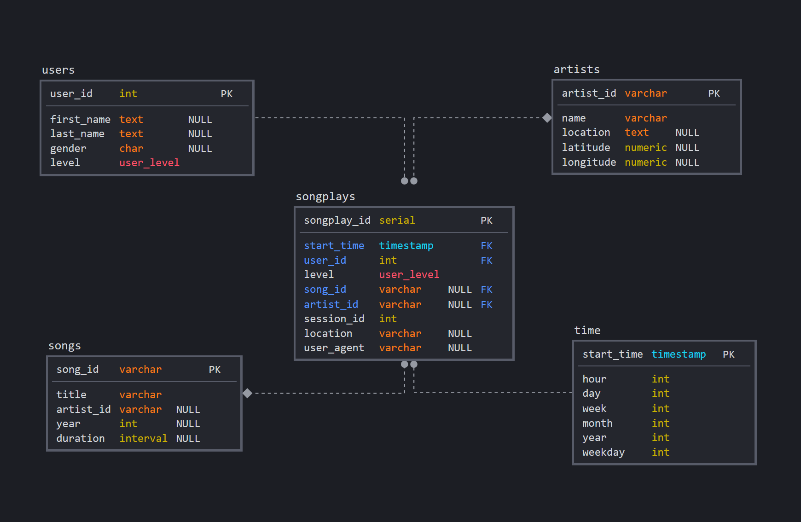

# udacity-postgresql-dm

## Sparkify DB
The Sparkify DB contains data on songs and song plays within 
the Sparkify music streaming app. The PostgreSQL DB is designed to 
optimize queries on song play analysis (see example queries below).

To set up the database and process the data in the directory 'data'
first run 'create_tables.py' with

```console
> python create_tables.py
```

and then run 'etl.py' with

```console
> python etl.py
```

### Project Folder
The project folder contains:

 - create_tables.py: Python script for setting up/resetting the DB
 - etl.ipynb: Jupyter Notebook for developing the ETL Process
 - example_queries.ipynb: Jupyter Notebook with two example queries
 - README.md: this file
 - sparkify_db_schema.png: DB schema shown below
 - sql_queries.py: the SQL queries used for table creation and data ingestion
 - test.ipynb: test SQL commands for checking on the DB
 
### Dataset
The dataset is split into song_data and log_data. 

Song data contains information about each song in the library, such as title, 
artist name, artist location, or duration in seconds.

The log data is a sequence of event logs partitioned by year and month. 
Log files are in JSON format and each JSON object contains information about one 
song play event, such as user_id, location, and song information like title and artist name. 
 
### Database Schema



**Fact Table**

*songplays:* records in log data associated with song plays i.e. records with page NextSong
  - songplay_id, start_time, user_id, level, song_id, artist_id, session_id, location, user_agent

**Dimension Tables**

*users:* users in the app
  - user_id, first_name, last_name, gender, level

*songs:* songs in music database
  - song_id, title, artist_id, year, duration

*artists:* artists in music database
  - artist_id, name, location, latitude, longitude

*time:* timestamps of records in songplays broken down into specific units
  - start_time, hour, day, week, month, year, weekday
  
The star schema with the central fact table '*songplays*' is designed to make queries about songplays
very easy by consolidating the relevant facts
  - start_time,
  - user level,
  - location, and
  - user_agent

in one table. Additional information about e.g.
  
  - user name
  - artist name
  - song name

can still be accessed via the references to the dimension tables.

 
## Example Queries
---------------
How many song plays are paid vs. how many song plays are free?
``` sql
SELECT level, COUNT(DISTINCT user_id) 
FROM songplays 
GROUP BY level;
```
|level|count|
|-----|-----|
|free |82   |
|paid |22   |

What are the top 5 power users?
``` sql
SELECT a.user_id, b.first_name, b.last_name, a.count 
FROM (SELECT s.user_id, COUNT(DISTINCT songplay_id) AS count 
      FROM songplays s GROUP BY user_id) a 
JOIN users b ON a.user_id = b.user_id 
ORDER BY a.count DESC 
LIMIT 5;
```
|user_id|first_name|last_name|count|
|-------|----------|---------|-----|
|49     |Chloe     |Cuevas   |689  |
|80     |Tegan     |Levine   |665  |
|97     |Kate      |Harrell  |557  |
|15     |Lily      |Koch     |463  |
|44     |Aleena    |Kirby    |397  |
